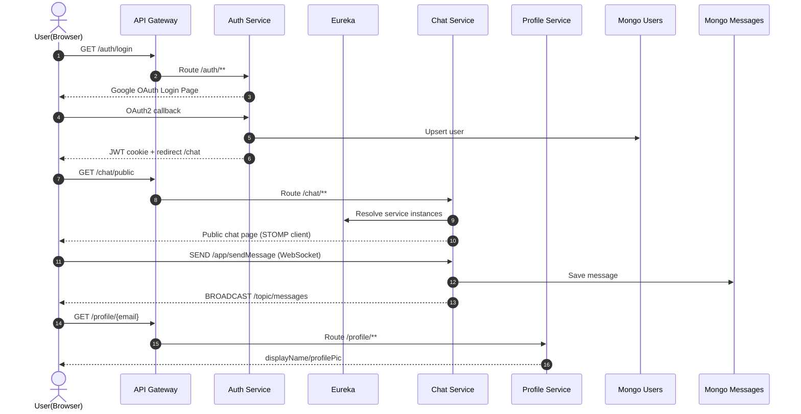

# Chat Web App

실시간 공개 채팅/개인 채팅을 제공하는 **Spring Boot 기반 마이크로서비스 애플리케이션**입니다.
서비스를 기능 단위로 분리하고(API Gateway, 인증, 채팅, 프로필, 서비스 디스커버리), Docker/Kubernetes 배포를 고려한 구조로 구성되어 있습니다.

---

## 1) 프로젝트 개요

이 프로젝트는 다음 목표를 중심으로 설계되었습니다.

- 실시간 메시징(공개 채팅 + 1:1 개인 채팅)
- OAuth2 기반 로그인 및 인증 정보 전파(JWT/쿠키 기반)
- 서비스 분리로 확장성과 유지보수성 확보
- 컨테이너 기반 로컬/클라우드 배포 용이성 확보

---

## 2) 서비스 구성

- **api-gateway**
  외부 요청의 단일 진입점 역할을 수행하며 내부 마이크로서비스로 라우팅합니다.

- **oauth**
  OAuth2 로그인(예: Google)과 인증/인가 처리, 사용자 기본 정보 관리를 담당합니다.

- **chat-service**
  공개 채팅/개인 채팅 메시지 처리, 대화방(Conversation) 및 메시지 저장 로직을 담당합니다.

- **profile-service**
  사용자 프로필(표시 이름, 프로필 이미지 등) 관련 조회/수정 기능을 담당합니다.

- **eureka-server**
  서비스 등록/탐색(Service Discovery)을 담당하며, 동적으로 서비스 위치를 찾을 수 있게 합니다.

- **frontend (React SPA)**
  API Gateway를 단일 진입점으로 사용하는 분리형 프론트엔드입니다.

---

## 3) 서비스 시퀀스 다이어그램

아래 다이어그램은 사용자 로그인 후 공개 채팅 메시지를 송수신하는 핵심 흐름을 나타냅니다.



## 4) 기술 스택 (상세)

### 백엔드

- **Java 17**
  각 서비스의 주요 구현 언어입니다.

- **Spring Boot 3.x**
  서비스별 독립 실행 애플리케이션 구성, 내장 WAS 기반 실행, 환경설정 단순화에 사용됩니다.

- **Spring Web / MVC**
  REST API 및 View(Thymeleaf) 렌더링 엔드포인트 구현에 사용됩니다.

- **Spring Security**
  인증/인가, 보안 필터 체인, 로그인/로그아웃 처리 등에 사용됩니다.

- **Spring Security OAuth2 Client**
  Google OAuth2 로그인 연동을 처리합니다.

- **Spring Cloud Gateway**
  API Gateway에서 요청 라우팅, 경로 기반 분기, 서비스 연계를 담당합니다.

- **Spring Cloud Netflix Eureka**
  서비스 등록/탐색을 통해 마이크로서비스 간 호출 유연성을 높입니다.

- **Spring Data MongoDB**
  채팅 메시지/대화 데이터 등 문서 지향 데이터 처리를 담당합니다.

- **WebSocket (STOMP)**
  채팅 실시간 양방향 통신을 구현합니다.

- **WebClient**
  서비스 간 비동기 HTTP 호출(예: 프로필/유저 정보 조회)에 사용됩니다.

### 데이터/인증

- **MongoDB**
  메시지, 대화, 사용자/프로필 관련 문서 저장소로 사용됩니다.

- **Redis**
  다중 인스턴스 WebSocket 이벤트 릴레이(Pub/Sub)에 사용됩니다.

- **JWT(JSON Web Token)**
  서비스 간 인증 컨텍스트 전달에 사용되며, 쿠키 기반 인증 흐름과 결합되어 사용됩니다.

- **OAuth2 (Google)**
  외부 소셜 로그인 공급자를 통한 사용자 인증에 사용됩니다.

### 프론트엔드

- **React + TypeScript + Vite**
  분리형 SPA 애플리케이션 구현에 사용됩니다.

- **Thymeleaf**
  기존 서버 렌더링 화면(점진 이관 대상)에 사용됩니다.

- **Tailwind CSS**
  SPA/서버 템플릿 화면의 유틸리티 기반 스타일링에 사용됩니다.

### 인프라/배포

- **Docker**
  각 서비스를 컨테이너 이미지로 패키징하고 실행 환경 일관성을 보장합니다.

- **Docker Compose**
  로컬 멀티 컨테이너 개발 환경(서비스 + 데이터스토어) 실행에 사용됩니다.

- **Kubernetes**
  서비스 오케스트레이션/확장/배포 관리를 위한 매니페스트 기반 운영에 사용됩니다.

- **Prometheus**
  Spring Actuator + Micrometer 메트릭 수집에 사용됩니다.

### 빌드/도구

- **Maven**
  멀티 서비스 빌드 및 의존성 관리를 담당합니다.

- **Maven Wrapper (`mvnw`)**
  로컬 Maven 설치 여부와 무관하게 동일 버전으로 빌드할 수 있도록 지원합니다.

---

## 5) 디렉터리 구조

```text
.
├── api-gateway/
├── chat-service/
├── eureka-server/
├── frontend/
├── monitoring/
├── oauth/
├── profile-service/
├── docker-compose.yml
└── kubernetes.yml
```

---

## 6) 실행 방법 (로컬)

### 방법 A. 서비스별 실행

각 서비스 디렉터리에서:

```bash
./mvnw spring-boot:run
```

권장 실행 순서:
1. eureka-server
2. oauth
3. profile-service
4. chat-service
5. api-gateway
6. frontend

프론트엔드 실행:

```bash
cd frontend
npm install
npm run dev
```

### 방법 B. Docker Compose 실행

```bash
docker compose up --build
```

- SPA: `http://localhost:5173`
- API Gateway: `http://localhost:9999`

### 방법 C. 테스트용 초기화 + 재실행 스크립트

기존 Docker 컨테이너/이미지를 모두 정리한 뒤, 이 레포를 다시 빌드/실행합니다.

```bash
./reset-and-run.sh
```

자동 확인(비대화형) 실행:

```bash
./reset-and-run.sh -y
```

### 방법 D. Docker 리셋 + MSA(Compose) + Kubernetes(kind) 일괄 배포

WSL/Ubuntu + Docker 환경에서 Docker 초기화부터 Compose 배포, kind 기반 Kubernetes 배포까지 한 번에 실행합니다.

```bash
./deploy-all.sh
```

비대화형 실행:

```bash
./deploy-all.sh -y
```

### OAuth 테스트 유저 자동 시드

`auth-service` 시작 시 아래 테스트 유저를 MongoDB(`chat-app-users.users`)에 upsert 합니다.

- `test1` / `123456`
- `test2` / `123456`
- `test3` / `123456`

---

## 7) UI 화면 캡처

아래 이미지는 `mcr.microsoft.com/playwright:v1.51.1-jammy` Docker 이미지로 자동 캡처했습니다.

```bash
docker run --rm \
  --add-host host.docker.internal:host-gateway \
  -v "$PWD:/work" -w /work \
  mcr.microsoft.com/playwright:v1.51.1-jammy \
  bash -lc "mkdir -p /tmp/pw && npm --prefix /tmp/pw init -y >/dev/null 2>&1 && npm --prefix /tmp/pw install playwright@1.51.1 >/dev/null 2>&1 && NODE_PATH=/tmp/pw/node_modules node scripts/capture-screenshots.cjs"
```

### 실행 후 화면


### 로그인 후 화면


### 로그인 후 채팅 화면


## 8) Private 저장소로 복제(본인 GitHub Repo로 이전) 방법

현재 실행 환경에서는 사용자의 GitHub 계정 인증 토큰/권한에 직접 접근할 수 없어, 원격 저장소 생성/푸시는 사용자가 한 번만 실행해야 합니다. 아래 절차대로 진행하면 됩니다.

1. GitHub에서 **새 Private Repository** 생성 (예: `chat-web-app-private`)
2. 로컬에서 원격 추가

```bash
git remote add my-private-repo https://github.com/<YOUR_ID>/chat-web-app-private.git
```

3. 브랜치 푸시

```bash
git push -u my-private-repo <YOUR_BRANCH>
```

4. 기본 브랜치 푸시(예: main)

```bash
git push my-private-repo main
```

> SSH를 사용하는 경우 remote URL을 `git@github.com:<YOUR_ID>/chat-web-app-private.git` 형태로 바꾸면 됩니다.

---

## 9) 9.1~9.5 개발 진행 상태

### 9.1 SPA 프론트엔드 분리
- `frontend/` (React + TypeScript + Vite + Tailwind) 신규 추가
- 로그인 후 대시보드/공개채팅/개인채팅 페이지 분리
- Nginx 기반 컨테이너(`frontend/Dockerfile`)와 Compose/Kubernetes 배포 정의 추가

### 9.2 읽음 처리 + unread 카운트
- 메시지 모델 `readBy` 필드 추가
- 대화 모델 `lastReadAtByUser`, `lastMessageAt`, `lastMessagePreview` 필드 추가
- API 추가:
  - `GET /chat/conversations/unread`
  - `POST /chat/conversations/{conversationId}/read`
  - `GET /chat/conversations/private?recipient=...`
- WebSocket read-receipt 이벤트(`/user/queue/private/{conversationId}/read`) 추가
- 기존 Thymeleaf 홈/개인채팅 화면에 unread 배지 및 읽음 상태 표시 반영

### 9.3 Redis Pub/Sub 기반 다중 인스턴스 WebSocket
- Redis Pub/Sub 이벤트 모델(`ChatRealtimeEvent`) 추가
- Redis publisher/subscriber 및 listener container 추가
- `APP_WEBSOCKET_REDIS_ENABLED=true` 시 WebSocket 이벤트를 Redis 경유로 릴레이
- Compose/Kubernetes에 Redis 서비스 추가

### 9.4 관측성(로그/메트릭/트레이싱)
- 전 서비스 Actuator + Prometheus + Micrometer Tracing 의존성 추가
- `/actuator/prometheus` 노출 및 traceId/spanId 로그 패턴 적용
- Compose에 Prometheus 서비스 및 스크랩 설정(`monitoring/prometheus.yml`) 추가

### 9.5 GitHub Actions 기반 CI/CD
- `.github/workflows/ci.yml`: PR/Push 시 백엔드 테스트 + 프론트 빌드
- `.github/workflows/cd.yml`: main 브랜치 Docker 이미지 빌드/푸시(서비스별 매트릭스) + 스모크체크 placeholder
